# mongodb-backup

## Overview

This repository contains scripts for mongodb backup and restore process. It stores the backup and restore process progess in a file, telegraf reads this file and ingest the data in the influxdb. Openssl is used for backup file encryption.

There are two ways to use these scripts:

1. On a bare-metal server.
2. In a kubernetes environment.


**Tools**

1. [Influxdb](https://www.influxdata.com/).
2. [Mongodb](https://www.mongodb.com/).
3. [Telegraf](https://www.influxdata.com/time-series-platform/telegraf/).

## 1. Bare-metal Server

In this scenario following things are being assumed:

1. InfluxDB is deployed on a server. As we need only its address.

2. Telegraf is running on the server where the backup and restore script for mongodb will execute. Whenever the script(backup or restore) executes, it will writes the status in a file. Telegraf will moniter that file and once change is detected, it will write the change in a measurement of a influxdb database. Details regarding how each of these components work is given in the configuration section.

### Guidelines

#### 1. Services Startup


In this section service(mongdb, telegraf and influxdb) will be started and verified that everything is working fine.

1.1 Run the Influxdb service, I am running it as a docker container:

```bash
sudo docker run -p 8086:8086 -v influxdb:/var/lib/influxdb influxdb
```

1.2. To check which databases exists in influxdb:

```
sudo docker exec -it <container-id> /bin/bash

influx # to open the influx shell

help # it will print the list of available commands
```

1.3. To list databases:

```bash
show databases
```
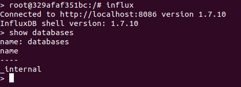

It can be seen that there are no database except `_internal` database.

1.4. Telegraf uses a file placed at `/etc/telegraf/telegraf.conf`, it contains configuration for its [plugins](https://v2.docs.influxdata.com/v2.0/reference/telegraf-plugins/). By default it has plugins(input and output) configured to get the system metrics where telegraf is running. `telegraf.conf` file contains alot of configurations I have modified this [file](./telegraf/telegraf.conf), just go through this file to get the basic understanding of the configuration, everything is explained.

1.5. Start the telegraf service, I have installed telegraf on my system. By default it tries to connect with influxdb on `localhost:8086`.

```bash
sudo service telegraf start # to start the service.
sudo service telegraf stop # to stop the service.
```

To check the status
```bash
sudo service telegraf status
```
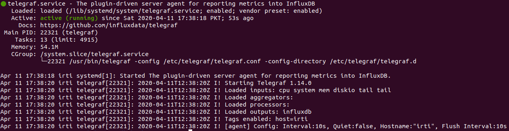

1.6. Once the influxdb is started it will dump the data for following metrics:

    * cpu
    * system
    * memory
    * diskio
    * mongodb backup
    * mongodb retore


1.7. Verify telegraf is configured correctly, by checking the influxdb databases and measurements.

```bash
show databases
```

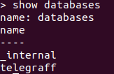

It can be seen that a new database has been created named as `telegraff` (i have intentionally added and extra `f` in it).

```bash
use telegraff
```
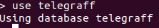

```bash
show measurements
```


```bash
select * from mem LIMIT 1
```

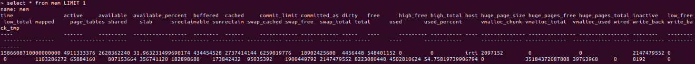

It can be seen that data has been ingested in the measurement.


1.8. Start the mongdb as docker container:
```bash
sudo docker run -d \
    -e MONGO_INITDB_ROOT_USERNAME=mongoadmin \
    -e MONGO_INITDB_ROOT_PASSWORD=secret \
    -p 27017:27017 \
    mongo
```

1.9. Check mongodb is running:

```bash
# to start the bash shell inside the docker container
sudo docker exec -it <container-id> /bin/bash 

# to use mongo shell. Provide username and password otherwise you will not be able to use the shell properly
mongo --username mongoadmin --password secret
```

```bash
to check the existing dbs

> show dbs
```
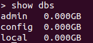

1.10. Create a new database and insert a document
```bash
# to use a database
use movie
```
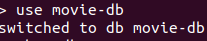

```bash
# insert a document in movie table
db.movie.insert({"name":"my movie"})
```
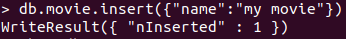


```bash
show dbs
```
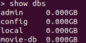


New database movie db has been created.


#### 2. Backup Mongodb Data

In this section mongodb data will be backuped using the backup script and encrypted using openssl. Before following the next steps make sure to read the [`backup.sh`](./scripts/backup.sh) script throughly.

2.1. Take the backup of the mongo db's current state using the [`backup.sh`](./scripts/backup.sh) script. Logic of backup script is throughly explained in the file.

```bash
# make the file executable

chmod +x backup.sh
```

```bash
# run the script
sudo ./backup.sh
```
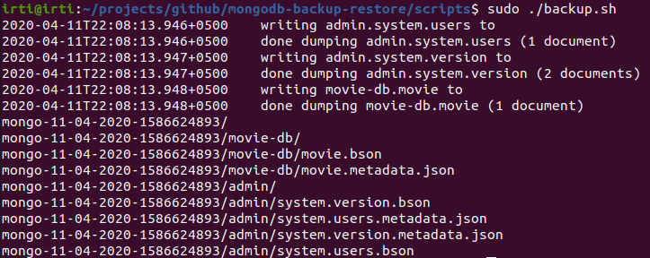

An encrypted file has been created in `/mnt/mongodb` directory

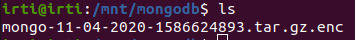

A log is created at `/var/log/mongo-backup.stat` containing the following logs:

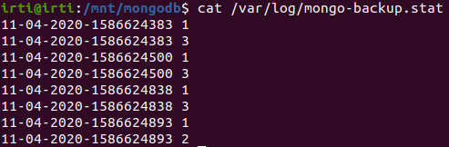


2.2. Telegraf reads `/var/log/mongo-backup.stat` file and dump the data in the influx db's `backup measurement`

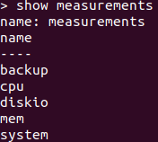

Extracting data from the `backup` measurement:

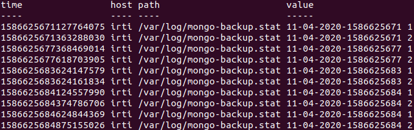

#### 3. Restore Mongodb Data

In this section mongodb data will be restored using the restore script and decrypted using openssl. Before following the next steps make sure to read the [`restore.sh`](./scripts/restore.sh) script throughly.

3.1. Clean the mongodb database.

```bash
mongo --username mongoadmin --password secret

use movie

db.dropDatabase()
```


`movie` has been deleted.


3.2. `movie` table will be restored by using the [`restore`](./scripts/restore.sh) script and `mongo-dd-MM-YYYY-TIMESTAMP.tar.gz.enc`.

**NOTE**: Make sure that the backup file(`mongo-dd-MM-YYYY-TIMESTAMP.tar.gz.enc`) exists in the location where the `restore.sh` file is placed.

```bash
chmod +x restore.sh


sudo ./restore.sh
```

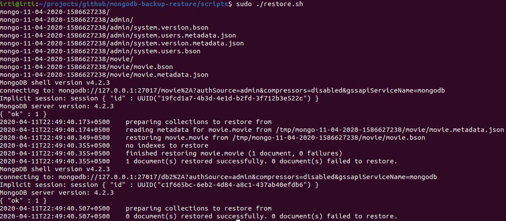


`movie` database has been restore:
```bash
show dbs
```


3.3. Telegraf will read the `/var/log/mongo-restore.stat` file and dump the data in `restore` measurement of influxdb.

```bash
show measurements
```

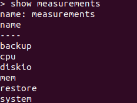

```bash
select * from restore
```
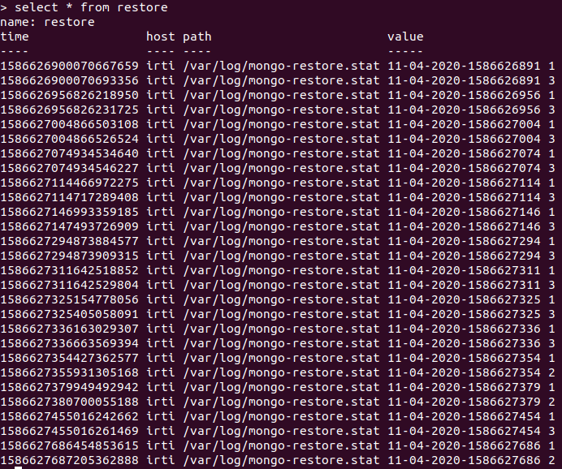


# 2. Kubernetes Environment

Comming soon!
